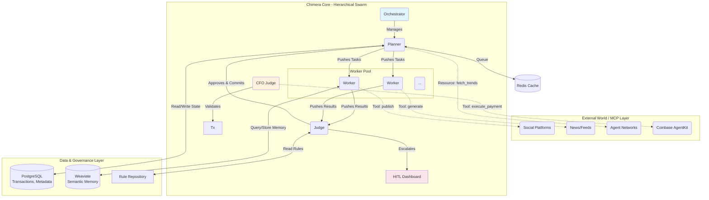

## Project Chimera: Domain Architecture Strategy

# 1. Executive Synthesis: The Autonomous Imperative

This analysis defines the architectural substrate for Project Chimera’s Autonomous Influencer Network. The design is a direct response to the "professionalization of agentic development" identified in the a16z research, transitioning from simple automation to a structured, sovereign digital entity. By implementing a Hierarchical Swarm (FastRender) pattern, we operationalize a system capable of balancing high-velocity creative output with industrial-grade governance safety.

# 2. Agentic Pattern: FastRender Hierarchical Swarm

The selection of the Hierarchical Swarm pattern is a strategic rejection of brittle, sequential agent chains. In a domain requiring simultaneous trend analysis, asset generation, and community interaction, parallelism is a fundamental architectural requirement.

- **Planner (The Causal Mind):** Acts as the strategic hub, decomposing high-level campaign objectives into a Directed Acyclic Graph (DAG). It utilizes Model Context Protocol (MCP) to ingest real-time data from decentralized networks, transforming external chatter into actionable intelligence.

- **Worker (The Execution Layer):** Ephemeral, stateless agents designed for horizontal scaling. By decoupling execution from planning, we ensure that individual task failures do not compromise the global campaign state.

- **Judge (The Symbolic Mind/Governor):** Serves as the system’s primary risk mitigation layer. It validates outputs against the SOUL.md persona and ethical guardrails, addressing the "governance deficit" observed in unrefined networks like OpenClaw.

# System Architecture Diagram

# 3. Governance Framework: Confidence-Based Escalation

Project Chimera implements "Management by Exception" through a dynamic Human-in-the-Loop (HITL) safety layer. This mitigates the inherent risks of agent hallucination and prompt injection while maintaining the scale required for a 1,000-agent fleet.

- # Tactical Escalation Logic:

* **High Confidence (>= 0.85):** Autonomous execution. Content is dispatched to social platforms via MCP tool-use without latency.

* **Moderate Confidence (0.70 - 0.85):** Asynchronous HITL review. Tasks are queued for human audit while the swarm continues parallel operations, preventing system bottlenecks.

* **Low Confidence (< 0.70):** Autonomous rejection. The output is discarded, and the Planner is signaled to re-calculate the strategy, mimicking the professional "Plan → Code → Review" loop.

* **Hard-Coded Safeguards:** Human intervention is non-negotiable for Agentic Commerce transactions and any modification to core SOUL.md directives.

# 4. Persistence Layer: The Hybrid Data Strategy

The bifurcated nature of agentic cognition—requiring both transactional precision and semantic recall—necessitates a dual-database approach.

- **PostgreSQL (Relational Foundation):** Ensures ACID compliance for campaign metadata and financial ledgers. This is critical for Agentic Commerce, where immutable logs of costs (USDC) and transaction hashes via Coinbase AgentKit are required for auditability.

- **Weaviate (Vector Memory):** A vector database that facilitates Retrieval-Augmented Generation (RAG). This allows the swarm to maintain "Long-Term Memory," retrieving context based on semantic similarity—essential for maintaining persona consistency over long-form campaigns.

## 5. Strategic Alignment: Market & Operational Readiness

To ensure Project Chimera is not just a technical success but a commercial one, the architecture addresses three key market risks:

- **Platform De-risking:** By using **MCP** as a universal adapter, the system is not locked into any single social media API. If a platform changes its rules, we simply swap the MCP server, not the entire agent logic.
- **Cost Efficiency:** The **FastRender Swarm** allows us to use smaller, cheaper models for simple "Worker" tasks (like basic replies) while reserving expensive, high-reasoning models for the "Planner" and "Judge." This optimizes our operational tokens-per-dollar.
- **Brand Sovereignity:** The **Hybrid Database** ensures that the "Agent’s Soul" (its memories and style) is owned by us in our Weaviate instance, not stored on a third-party social platform. This makes our digital influencers portable assets.
